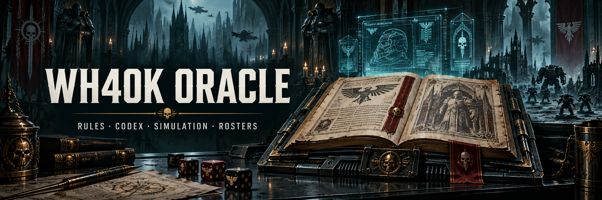
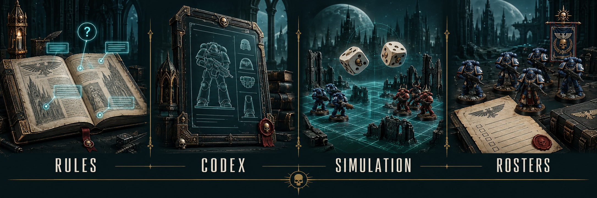

# wh40k-oracle · 战锤40K 垂类 AI

面向战锤40K（Warhammer 40,000）**第 11 版**的本地知识智库。从"规则书 PDF 问答"起步，已长成四位一体的垂类系统：**规则问答 + 单位图鉴 + 对战模拟 + 军表实验室**，共享同一套结构化数据。全程本地嵌入、可切换云端 LLM。

> 当前定位：现行**第 11 版**（2026-06-20 生效）。语料按层组织——11 版核心规则（规则唯一真源）+ Faction Pack 补丁 + MFM/平衡版点数 + 十版 codex 兵牌基底。设计蓝图见 `docs/superpowers/`。

## October 4 supported setup and local release boundary

The supported setup is **CPython 3.11 with CPU dependencies**, a local FastAPI/Next.js website, and separately acquired, reviewed data assets. A code clone does not supply the model, FAISS index, SQLite database, complete source caches or complete licensed rules. The commands below are checked against the current files; installation and integrated release acceptance were not rerun for this documentation change. See the [supported-setup acceptance report](docs/superpowers/reports/2026-10-04-supported-setup-acceptance.md) and [dependency evidence](docs/superpowers/reports/2026-09-30-python-security-acceptance.md).

The September 20 local acceptance established faction-aware lookup, faction inventory, roster text import and session recall on that dated candidate. Web answers distinguish merged-card evidence from PDF page references; named rule-table omissions expose the full reply. Its [roadmap](docs/superpowers/plans/2026-09-20-local-completion.md) and [acceptance evidence](docs/superpowers/reports/2026-09-20-lookup-deployment-acceptance.md) are historical, not acceptance of the October release candidate. Independent host review, scheduled stage-only update wiring, full actual-asset native/Docker/browser checks, the 115-question benchmark, fresh hosted CI and publication remain release gates. Cloud deployment is deferred; this finite local release makes no ongoing maintenance or universal zero-mistake promise.

After a chat answer finishes, use **下载回答（Markdown）** to request a Markdown download or **查看 / 复制 Markdown** to select and copy the text into Obsidian or a `.md` file. The export includes citations and the complete answer snapshot, explicitly labeled as unreviewed AI output. Saving it does not add it to the official rule corpus. Browser download support can vary; the visible copy panel provides an alternative.

## Historical September 14 release checkpoint

The September 14 snapshot stored a **3,893-row source ledger**: **1,322 comparable unit tiers** agreed and 203 enhancement rows were updated. The codex exposes source-only prices as well as matched datasheets. These figures describe that snapshot, not the latest capture or full rule coverage.

That candidate included roster text import, conversation history, source links and clearer failures. Its **2,496 tests**, frontend lint/build and wiki lint passed. Forty official PDFs were downloaded; 27 changed Faction Packs and Universal Rules Updates were refreshed locally and indexed.

The report's Docker/WSL and audit blockers are historical; current release gates are listed above. The Chinese change list is explicitly dated as a July snapshot. See the [September 14 acceptance report](docs/superpowers/reports/2026-09-14-release-acceptance.md) for its exact coverage and reproduction evidence.

## 四大能力



<sub>The banner and feature illustration are AI-generated project artwork.</sub>

| 能力 | 说的话 / 入口 | 底层 |
|---|---|---|
| **规则问答** | "先攻怎么判定？"→ 检索规则页 → LLM 带**书名+页码**引用作答 | 混合检索链 + Agent 工具模式 + 11 版规则层保底 |
| **单位图鉴** | 浏览阵营 → 单位 → 完整兵牌（属性/武器/技能/点数，中英切换） | `db/wh40k.sqlite` 结构库 + 三层中文别名 |
| **对战模拟** | "10 个终结者打 20 个狂热者" → 逐骰蒙特卡洛模拟 | `engines/simulator/`（11 版规则：先攻/掩体命中侧惩罚/USR） |
| **军表实验室** | 粘贴/搭建军表 → 验表（点数+编制约束）+ 强度点评 | `engines/roster/` + 接模拟器做强度评估 |

四大能力都已上网站（`web/` 四页签）。规则问答还内建 **Agent 模式**（默认开启）：LLM 自主调用检索、图鉴、模拟工具，边查边答。

## 架构总览

```
                          分层数据源（按已审查快照对齐）
     ┌───────────────────────────────────────────────────────────┐
     │  MFM 官方点数手册 ─┐                                          │
     │  Wahapedia CSV ───┼─► db_compile ─► db/wh40k.sqlite ◄─ BSData 交叉校验
     │  黑图书馆社区 API ─┘        │        （units/weapons/abilities/       │
     └────────────────────────────┼──────── stratagems/enhancements…）─────┘
                                   │              ▲
   data/ 原始 PDF ─► ingest.py ─► FAISS 向量库    │ dsl_payloads/ 28 阵营技能 DSL 投影
        │  (PyMuPDF→llm_refine→bge-m3 嵌入)  │    │
        ▼                                    ▼    ▼
  ┌──────────────────────────────────────────────────────────┐
  │  检索链：FAISS + BM25(jieba) + 查询别名扩展 + RRF 融合       │
  │          + 11 版规则层保底 ─► LLM ─► 带引用中文回答          │
  └──────────────────────────────────────────────────────────┘
        ▲                                    ▲          ▲
        │  engines/simulator（逐骰对战）      │  engines/roster（验表+点评）
        │                                    │
   web_api/（FastAPI）◄──────────────────────┴── web/（Next.js 四页签）
```

## Source authority and coverage limits

- **Official rules and numbers:** Games Workshop Core Rules, dated Faction Pack/field corrections and official MFM prices supply the authority for their verified fields. Wahapedia is a community structured mirror; BSData is a secondary comparison source. A price match does not validate the corresponding rule body.
- **Chinese text:** official GW Chinese takes precedence where verified. Retained, identity-checked 黑图书馆 (Black Library community service) Chinese details are a separate community translation layer, not GW's publisher or an official full Codex. Unsupported fragments stay in English. Fan-translated rules PDFs and their affected retrieval/cache/provenance inputs were retired; excluded archives must not be re-ingested. See the [retirement acceptance](docs/superpowers/reports/2026-09-30-source-retirement-acceptance.md).
- **Missing rule bodies:** the latest complete Space Marines/chapter Codex bodies are unavailable in the reviewed inputs. Source-only MFM entries may expose a price, but cannot manufacture a datasheet, abilities or legal-start date. Public Ork previews remain previews; **47 historical canonical names remain unproven**.
- **Community capture limits:** four wrong-identity detail responses recur in the October 4 fresh capture and remain quarantined. The separate reviewed policy candidate at `dd1d23d2f` classifies 94 empty listings as **43 duplicates / 36 Legends / 15 other empty**. Exclusions bind each whole sanitized own row; source changes reopen review. This fresh policy is not merged into this setup checkout and is not a deployment claim. Canonical units and full cards are retained; older reports' 49/36/9 classification is historical.
- **Dates and freshness:** the complete MFM raw snapshot captured October 4 local time has **3,635 ledger rows** and September 30 source context. Capture time, printed/published date and legal effective date are distinct; capture alone does not prove when a price or rule becomes legal. This reviewed capture is not proof of active promotion. Compare complete raw manifests, faction/section/tier coverage and exact identities before applying; parser success alone is insufficient.
- **Simulation:** `dsl_payloads/*.json` defines the modeled faction effects. Existing `encoded` / `partial` / `not_modeled` disclosures describe coverage; simulation and AI answers require review against the applicable sources.

## 技术栈

| 模块 | 方案 |
|---|---|
| PDF 解析 / 重构 | PyMuPDF + LLM 结构化重排（`llm_refine.py`，按页内容哈希缓存） |
| 嵌入 | `BAAI/bge-m3`（本地 CPU 推理，走 hf-mirror 镜像） |
| 向量库 / 关键词 | FAISS + BM25（jieba 中文分词） |
| 融合 | Reciprocal Rank Fusion (RRF)；FlashRank 重排**默认关闭**（实测中文重排差于 RRF） |
| 结构库 | SQLite（datasheets/units/models/weapons/abilities/stratagems/detachments/enhancements/aliases/unit_zh_detail…） |
| 阵营技能 | 自研 Effect DSL，28 阵营逐条编码 → 投影进库供模拟器 |
| LLM | DeepSeek `deepseek-flash` (non-thinking mode) / 智谱 `glm-4-flash`（OpenAI 兼容，可切换） |
| 后端 / 前端 | FastAPI（`web_api/`）+ Next.js（`web/`，四页签） |
| 交互问答 | Streamlit（`app.py`，本地快速试） |

## Supported installation

Use **CPython 3.11** on Windows/PowerShell or Linux. Existing Python 3.9 environments are historical and do not satisfy the current dependency set. Allow enough memory/disk for CPU inference and multi-GB model/source assets; 16 GB RAM is a useful local-development target. For native frontend work, use Node.js 22 as in [web/Dockerfile](web/Dockerfile); the locked Next.js 16.3.7 package declares a minimum of Node **20.9.0**. Docker Desktop/Compose is needed only for the container path.

From the repository root, create a **new** virtual environment with an installed 3.11 executable. The Windows example uses the known local installation; on another machine substitute its actual full CPython 3.11 path. Preserve an old environment separately before replacing it.

```powershell
& 'C:\Users\Administrator\AppData\Local\Programs\Python\Python311\python.exe' -m venv .venv
$projectPython = Join-Path (Get-Location).Path '.venv\Scripts\python.exe'
& $projectPython -m pip install -r requirements-bootstrap.txt
& $projectPython -m pip install --build-constraint requirements-bootstrap.txt -r requirements-torch-cpu.txt
& $projectPython -m pip install --build-constraint requirements-bootstrap.txt -c constraints-python311.txt -r requirements.txt
& $projectPython -m pip check
```

The bootstrap pins pip **26.2.1** and setuptools **83.0.0**. `--build-constraint` requires pip 25.3 or later, so bootstrap comes first. [requirements-torch-cpu.txt](requirements-torch-cpu.txt) scopes the PyTorch CPU index to the separate **torch 2.14.0+cpu** step. [requirements.txt](requirements.txt) includes runtime and development requirements; its runtime chain also requires that exact CPU wheel and includes [constraints-python311.txt](constraints-python311.txt). Do not replace this sequence with an unconstrained framework/torch upgrade or use the CPU index for unrelated packages. The Dockerfile uses the same bootstrap/CPU order with the runtime-only `requirements-docker.txt` set.

Linux equivalent, also from the repository root:

```bash
python3.11 -m venv .venv
projectPython="$(pwd)/.venv/bin/python"
"$projectPython" -m pip install -r requirements-bootstrap.txt
"$projectPython" -m pip install --build-constraint requirements-bootstrap.txt -r requirements-torch-cpu.txt
"$projectPython" -m pip install --build-constraint requirements-bootstrap.txt -c constraints-python311.txt -r requirements.txt
"$projectPython" -m pip check
```

These are declaration-verified installation commands, not a claim that a new installation was performed for this README. PowerShell commands below reuse the absolute `$projectPython` set above. In each new shell, set it again from the repository root.

Copy the environment template only if `.env` does not already exist:

```powershell
if (-not (Test-Path -LiteralPath '.env')) { Copy-Item -LiteralPath '.env.example' -Destination '.env' }
```

Configure `DEEPSEEK_API_KEY` through the environment or the local ignored `.env`; its template value is empty. Keep actual keys out of Git and shared output. Missing LLM configuration is reported as unavailable; it does not create a working AI answer. Review the template's local CORS, warmup and proxy settings. Native Uvicorn needs `--env-file .env` to load those settings; Compose reads `.env` for its declared substitutions. `NEXT_PUBLIC_API_BASE` is a browser-reachable **build-time** URL, normally `http://localhost:8000`, and requires a frontend rebuild if changed.

## Acquire assets before running or rebuilding

The repository contains code, generated wiki material and limited historical examples. Large assets are ignored by Git. Obtain rule PDFs only through sources you are entitled to use, such as [GW's official downloads](https://www.warhammer-community.com/en-gb/downloads/warhammer-40000/); this repository grants no rights to download or redistribute licensed Codex bodies. Preserve the reviewed corpus filenames, hashes, dates and provenance in `corpus_manifest.json` and the associated source records. Do not restore retired fan translations from archives.

| Asset | Required local content and acquisition boundary |
| --- | --- |
| `opt/` | Complete `BAAI/bge-m3` sentence-transformers snapshot from its [model repository](https://huggingface.co/BAAI/bge-m3), including modules/config/tokenizer/weights and referenced submodules, under `opt/models--BAAI--bge-m3/snapshots/<revision>/`. Preserve the full HF cache layout and record the revision. The app selects a snapshot with `modules.json` and passes its **absolute path** for CPU loading; without it the app falls back to the model name and may download via hf-mirror. `ingest.py` still passes the model name with `opt/` as its cache, so ingestion is not guaranteed network-free. Do not force `HF_HUB_OFFLINE=1` as a substitute for a complete snapshot. |
| Optional reranker | `ms-marco-MiniLM-L-12-v2` FlashRank files under `opt/` are needed only when enabling reranking. `USE_RERANKER=False` is the current default; no reranker is required for that path. |
| `local_vector_store/` | Both nonempty `index.faiss` **and** `index.pkl`, produced from your reviewed corpus by ingestion. Use only your own trusted local index/docstore: loading enables pickle deserialization. A downloaded untrusted index is unsafe. |
| `db/wh40k.sqlite` | A complete reviewed database for codex, simulation and rosters. Restore a trusted local asset with its provenance, or build from the complete CSV/authority/cache inputs below. PDF ingestion does not create this database. |
| `wiki/` | Generated pages, `index.md`, `indexes/keywords.json`, terms and metadata consistent with the database and retained sources. Keep the tracked/generated files together. Rebuilding indexes alone does not generate missing rule/entity pages. |
| Native build inputs | Retained lawful PDFs in `data/`, permitted refined/raw source caches, `db_sources/wahapedia/`, verified official correction inputs, MFM raw HTML/hash manifests/cache, and retained community inventory/details/provenance. These are needed for reproducible builds even though Docker runtime mounts only the four assets above. |

### Structured source acquisition and restoration

`wiki_compile fetch-canonical` downloads **only `Factions.csv` and `Datasheets.csv`**. It is a bilingual-name anchor downloader, not full website acquisition. `db_compile build` additionally consumes these exact cached exports in `db_sources/wahapedia/`:

- `Datasheets_models.csv` and `Datasheets_models_cost.csv`: model attributes and model-count/price tiers.
- `Datasheets_wargear.csv`: inline weapon names and statistics; the separate `Wargear.csv` is a known unavailable export and is not required.
- `Abilities.csv` and `Datasheets_abilities.csv`: master ability bodies and unit links.
- `Stratagems.csv`, `Detachment_abilities.csv`, `Enhancements.csv`, `Datasheets_keywords.csv`: rule entities, detachment associations, enhancements and keyword membership.

Composition/loadout, transport, leader text and source links also depend on retained `Datasheets.csv` fields and reviewed community composition details; model-count tiers come from the cost rows. There is no complete acquisition command that infers these missing fields from PDFs or two name tables. `build` can import a partial set: inspect every reported missing CSV, row reconciliation, skipped row and required table rather than treating exit success as completeness. `Enhancements.csv` is imported when present but is outside the current `EXPECTED_CSV` missing-file list.

The following acquisition example writes the other nine supported exports using the **same base URL as the checked-out canonical downloader**. Download into a separate review directory before replacing retained inputs. It does not certify upstream freshness, identity or full Codex authority; validate headers, hashes, complete row counts and required fields against the retained snapshot. Set shell `HTTP_PROXY`/`HTTPS_PROXY` for network tools if your connection requires a proxy.

```powershell
$csvStage = Join-Path (Get-Location).Path 'db_sources/wahapedia-staged'
& $projectPython -m wiki_compile fetch-canonical --dest $csvStage
$extraTables = @(
  'Datasheets_models.csv', 'Datasheets_models_cost.csv', 'Datasheets_wargear.csv',
  'Abilities.csv', 'Datasheets_abilities.csv', 'Stratagems.csv',
  'Detachment_abilities.csv', 'Enhancements.csv', 'Datasheets_keywords.csv'
)
$downloadOptions = @{ UseBasicParsing = $true }
if ($env:HTTPS_PROXY) { $downloadOptions.Proxy = $env:HTTPS_PROXY }
foreach ($table in $extraTables) {
  Invoke-WebRequest @downloadOptions -Uri "https://wahapedia.ru/wh40k10ed/$table" -OutFile (Join-Path $csvStage $table)
}
```

A full restoration also needs `wiki/terms.json`, the reviewed `db_compile/source_reconcile_patches.json` and bound official PDF/source evidence, Faction Pack correction files, `db_compile/official_zh_names.json`, `dsl_payloads/`, permitted `data_refined/`, and `db_sources/blacklibrary/units.json` / `details.json` with retained raw snapshot/provenance and identity/listing policies. Preserve the adjacent `aliases_history.json` and `weapon_names_history.json` when reproducing retained mappings. Community cache refresh and identity validation are separate review work; a fresh inventory or successful HTTP response does not prove a correct full detail body. Keep `db_sources/mfm/mfm_points.json` with its complete `source_snapshot` and raw HTML/manifests. `db_sources/bsdata/` is needed for the secondary crosscheck; `db_sources/downloads/manifest.json` is the download catalogue baseline. None is supplied by the two-table downloader.

### Build only after those inputs are reviewed

Back up the current assets and run the build in an isolated copy before active promotion. These commands describe the existing **mutating** native pipeline, not a stage-only release workflow:

```powershell
& $projectPython -m db_compile build
& $projectPython -m db_compile mfm --check
& $projectPython -m wiki_engine.from_db
& $projectPython -m wiki_engine entities
& $projectPython -m wiki_engine keywords
& $projectPython -m wiki_engine build
& $projectPython -m wiki_engine lint
& $projectPython ingest.py --rebuild
```

`db_compile build` imports into a temporary SQLite file and replaces the database after a successful import, then automatically runs **offline** `restore_authority_layers` from local inputs. That restoration reapplies reviewed corrections, official MFM, official Chinese names, DSL, aliases and community Chinese/weapon layers. It is not a transaction across the entire restoration pipeline: missing inputs, warnings or critical failure require review before use. Do not use `--no-restore` for a supported complete build. After Chinese/source/database changes, `ingest.py --rebuild` refreshes the Black Library retrieval chunks; ordinary incremental `ingest.py` does not refresh that layer.

The wiki commands above regenerate unit/entity/keyword pages and indexes from available sources; they do not acquire missing full rule bodies. Core-rule/changelog/curated generation requires the corresponding retained official PDFs/refined content and verified hashes; keep existing reviewed pages until those inputs are available. Generated pages must use normal generators, followed by lint, rather than manual rule-body edits.

For an intentional reviewed source refresh, `-m db_compile mfm --fetch` captures official MFM, `mfm --check` compares and `mfm --apply` writes it. `-m db_compile update` pulls BSData, fetches MFM, rebuilds/restores, compares and checks downloads; `update --offline` reuses caches **but still rebuilds/writes**. Neither is safe staging merely because it is called offline. Scheduled stage-only wiring and promotion acceptance remain separate release work. The bilingual terminology sequence is `-m wiki_compile extract`, `pair` (optional `--llm`, requiring a configured key), then `terms`; it consumes retained permitted refined material and the canonical tables.

## Run with existing reviewed assets

For Streamlit from the repository root:

```powershell
.\run_streamlit.ps1
```

The launcher requires the project's CPython 3.11 `.venv`, uses its full executable path, and forwards Streamlit arguments. For the native four-tab website, start the API in one shell:

```powershell
$projectPython = Join-Path (Get-Location).Path '.venv\Scripts\python.exe'
& $projectPython -m uvicorn web_api.main:app --host 127.0.0.1 --port 8000 --env-file .env --reload
```

In another shell from the repository root, install the locked frontend dependencies and choose development or production:

```powershell
Set-Location web
npm ci
npm run dev
```

For production use `npm run build` followed by `npm start` instead of `npm run dev`; `start` runs `scripts/start.mjs`, which copies public/static files into the standalone build and defaults to loopback. Existing checks are `npm run lint`, `npm run test:unit` and `npm run test:e2e`; the unit-test script also needs a Node release supporting `--experimental-strip-types`, beyond Next's minimum. These commands were inspected, not executed in this documentation slice.

### Local Docker with existing assets

Place `opt/`, both FAISS components, `db/wh40k.sqlite` and the consistent `wiki/` at the Compose root first. The images contain code/dependencies; building them does not acquire these assets or the native-build source caches. With `.env` configured, from the repository root:

```powershell
docker compose build
docker compose up -d
docker compose logs api
Invoke-RestMethod -Uri 'http://127.0.0.1:8000/healthz'
# After local use:
docker compose down
```

Compose binds API/web to **127.0.0.1:8000 / 127.0.0.1:3000**. Both Dockerfiles run as non-root users. The API mounts `opt`, `local_vector_store`, `db` and `wiki` read-only. Native acquisition/build writes happen on the host, not through those runtime mounts. `DOCKER_BUILD_PROXY` and `DOCKER_RUNTIME_PROXY` are separate optional settings; keep credentials out of build arguments.

`/healthz.ok=true` and the image's HTTP healthcheck establish process liveness only. For enabled retrieval, require `retrieval=true`, `ready=true`, all **five** asset entries `ok=true` (`embed_model`, `vector_store`, `structured_db`, `wiki`, `keyword_index`), `warmup.requested=true`, `warmup.done=true`, `warmup.error=null`, and the log `[warmup]` confirming the vectorstore loaded. Wiki and keyword-index checks are currently optional for `ready`, so inspect them separately for the full website. Preflight checks presence/basic shape, not complete semantic correctness; exercise a real retrieval/card after startup. Compose defaults `WEB_API_WARMUP=1`. Missing required assets give `ready=false`; set `WEB_API_PREFLIGHT_STRICT=1` to refuse startup. `WEB_API_RETRIEVAL=off` is a reduced capability mode, not acceptance of full retrieval; the current Compose environment does not forward that variable automatically. No service was started or live readiness claimed for this README change.

## 项目结构

```text
.
├── app.py                   # Streamlit 应用：混合检索 + 查询扩展 + LLM 回答
├── ingest.py                # PDF 入库与索引构建（优先读 data_refined/）
├── llm_refine.py            # LLM PDF 重构（兵牌页 → 结构化 Markdown，哈希缓存）
├── agent/                   # Agent 工具模式：LLM 自主调用检索/图鉴/模拟工具
├── engines/
│   ├── simulator/           # 11 版逐骰对战蒙特卡洛模拟
│   └── roster/              # 军表验表（点数+编制约束）+ 强度点评
├── db_compile/              # 结构库编译：mfm/build/crosscheck/dsl-apply/update…
├── dsl_payloads/            # 28 阵营技能 DSL 真源（投影进库）
├── db/wh40k.sqlite          # 结构化库（需另备本地资产）
├── db_sources/              # 分层源缓存：mfm / wahapedia / bsdata / blacklibrary
├── web_api/                 # FastAPI：/chat /codex /simulate /roster …
├── web/                     # Next.js 四页签前端（聊天/图鉴/模拟器/军表）
├── wiki_compile/            # 双语术语表流水线
├── benchmarks/              # QA 基准（v1_10th / v3_edition11）
├── tests/                   # pytest 测试
├── docs/superpowers/        # 设计蓝图与迁移计划
├── data/  data_refined/     # 原始 PDF / LLM 重构结果（大部分不入库）
├── local_vector_store/      # FAISS 索引（不入库）
└── opt/                     # 模型缓存（不入库）
```

## Verification

```powershell
$projectPython = Join-Path (Get-Location).Path '.venv\Scripts\python.exe'
& $projectPython -m pytest tests/ -q
```

Default root collection is also scoped to `tests/` by `pytest.ini`. Model-free CI uses its own requirement set and an explicit existing retrieval-module import boundary; it does not establish full local-asset acceptance. Full native verification requires the real source/model/cache/database assets above. Consult the supported-setup report for the exact previously executed selected checks and the outstanding integrated release gates.

## Data and rights

Rule PDFs and derived text are copyrighted. `data/`, most `data_refined/`, models, indexes, databases and raw source caches are local assets excluded from Git; limited tracked historical examples do not establish a complete supported corpus. Retired fan translations remain excluded even when an old example or report is retained. Acquire and use sources only within their applicable rights; this repository provides no license to redistribute GW rules, community translations or a full source pack. No new project license is asserted here. Official current publications govern play. This project is for personal learning and technical demonstration and is unaffiliated with Games Workshop.

## 路线图

**已完成**

The following implemented capabilities retain their dated acceptance history; they do not close the current release gates.

- 检索问答链（混合检索 + 双语术语扩展 + 11 版规则层保底 + Agent 工具模式）
- 11 版迁移全线收官（语料分层、检索版本感知、模拟器 11 版化、基准 v3 = 99.0 零硬错）
- 结构化库 + 分层数据管线（MFM 点数 / Wahapedia / BSData 交叉校验 / update）
- 对战模拟器 + 军表实验室（验表 + 点评）
- 网站化四页签（Next.js + FastAPI，契约真源单点镜像）
- 阵营技能 DSL：28 阵营逐条编码并投影进库
- 容器化部署（docker-compose 两服务 + 只读资产卷、限流/CORS、启动资产前置校验）

**Current finite release gates**

- Independent supported-setup/source candidate review and integration.
- Scheduled stage-only update wiring and checked promotion boundaries.
- Full actual-asset native, local Docker/browser and 115-question benchmark acceptance on the integrated candidate, followed by fresh hosted CI and publication.
- Preserve the dated source gaps and partial modeling disclosures above. Cloud remains deferred; later source refreshes or coverage expansion need separate review.
